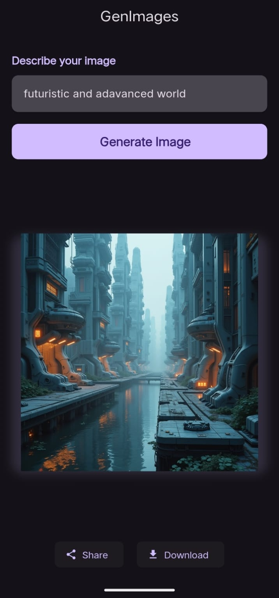

# 🎨 AI Image Generator Mobile App

  
  
  
  

  <h3>✨ Transform your ideas into stunning AI-generated images ✨</h3>
  
A powerful Flutter application that harnesses cutting-edge AI technology to generate, share, and download beautiful images from text prompts.

---

## 🚀 Features

### 🎯 Core Functionality
- **🤖 AI Image Generation** - Transform text prompts into stunning visual artworks
- **📱 Cross-Platform** - Seamless experience on both iOS and Android
- **💾 Download Images** - Save your creations directly to device gallery
- **🔗 Share Anywhere** - Instantly share images across social platforms
- **🎨 Multiple Styles** - Generate images in various artistic styles and formats

### 🏗️ Technical Excellence
- **🏛️ BLoC Architecture** - Clean, scalable, and maintainable code structure
- **🌐 API Integration** - Robust integration with AI image generation services
- **📊 State Management** - Efficient state handling with Flutter BLoC
- **🎭 Responsive UI** - Beautiful, adaptive interface across all screen sizes
- **⚡ Performance Optimized** - Smooth animations and efficient resource usage

---

## 📱 Screenshots

  

---

## 🛠️ Tech Stack

### Frontend
- **Flutter** - Cross-platform UI framework
- **Dart** - Programming language

### State Management
- **Flutter BLoC** - Business Logic Component pattern
- **Equatable** - Value equality for states and events

### API & Networking
- **Dio** - REST API communication
- **JSON Annotation** - Serialization support
- **Connectivity Plus** - Network status monitoring

### Storage & Media
- **Path Provider** - File system access
- **Image Gallery Saver** - Save images to device gallery
- **Share Plus** - Social sharing functionality

---

## 🎨 Features Showcase

### 🖼️ Image Generation
- **Smart Prompts** - AI-powered prompt suggestions
- **High Quality** - Support for various resolutions

### 💾 Download & Save
- **Gallery Integration** - Automatic gallery saving
- **Custom Folders** - Organized image storage
- **Metadata Preservation** - Keep generation parameters

---

  <h3>⭐ If you like this project, please give it a star! ⭐</h3>
  
Made with ❤️ by Jugal Mahida

